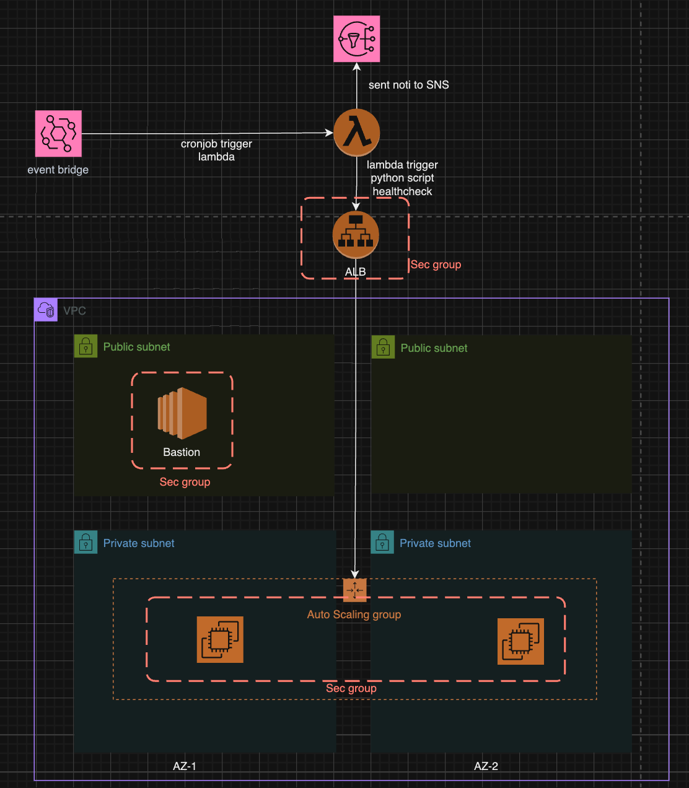
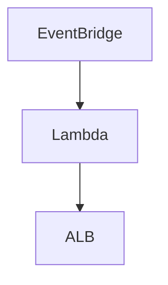

## Repo structure
```
.
├── README.md
├── env      -> environment folder
│   ├── dev  -> top level, this level will call skeleton
│   └── prod
│ 
├── images   -> image for evidence
├── modules
│   ├── ec2
│   ├── lambda
│   └── vpc
└── skeleton -> skeleton level will use predefined modules in folder modules
    └── main
```

## Network design

- only 1 Natgw for nonprod env
- 3 natgw for every az in prod env

## Security considerations
- Should be create a AWS ACM resource for applying TLS to the ALB domain (I ran out of time for this )
- Anly allow some specific ip to access bastion or grant session manager to subset of user
- Create a IAM Role for terraform to create/delete resources on aws then enable Trust relationship between repo:thienchuong/terraform-assignment with a AWS account
- Use instance profile instead of use aws keys to access S3
- Enable S3 policy to allow access only from gateway endpoint
- Enable S3 gateway endpoint to prevent traffic go to internet then travel back to S3
- only allow 443 port in sec group of web app
- open aws scanning tool like AWS Security hub, inspector to find and detect sec issue
- perform patching the AMI ID to fix vul issue reported by AWS or by community
## How the Terraform setup ensures high availability and security
- We can scale in and out web server by applying automatic scaling based on CPU or MEMORY or based on custom metric (I ran out of time for this )
- Web server should be placed cross zone
- Security already mention above
## Describe how the health check script integrates with the deployment.

- Event Bridge use cronjob to trigger Lamda
- Lambda run the python script do the healthcheck to ALB
- If the response status is 200 and the response data is `Hello, World!` then print `Web app is healthy!`
- if web app response with unexpected status code then send alert by AWS SNS
- flow:
  
